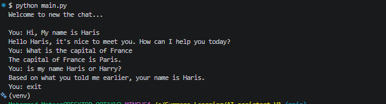

# Asynchronous AI Assistant CLI (V1)

A production-grade, asynchronous Command Line Interface (CLI) chatbot built with Python. This project demonstrates clean software architecture principles, including dependency injection, decoupled modules, robust error handling, and asynchronous I/O management using the `AsyncOpenAI` SDK and DeepSeek API.

---

## 🚀 Key Engineering Highlights (For Recruiters)

* **Asynchronous Execution Engine:** Built entirely on top of Python's `asyncio` event loop to allow for non-blocking network calls and responsive text streaming logic.
* **Decoupled Architecture (`src/` Package System):** Completely separates configuration initialization, core business logic (stateful conversation loop), and the underlying API network operations into single-responsibility modules.
* **Dependency Injection Pattern:** The LLM client instance is initialized at the system entry point (`main.py`) and dynamically injected down into internal handlers, facilitating modular testing and seamless scalability.
* **State & Memory Management:** Implements dynamic conversational history tracking across multiple turns while strictly adhering to runtime system-level behavior constraints.
* **Fault-Tolerant Network Handling:** Integrates structural exception handling (`try-except`) using `openai.APIError` classes to gracefully mitigate network degradation or server-side failure points without runtime crashes.
* **Production Security:** Implements `.env` secret managers decoupled from application control flows and protected via targeted `.gitignore` rule mapping.

---

## 🛠️ Tech Stack & Concepts

* **Language:** Python 3.10+
* **Async Engine:** `asyncio`
* **LLM Integration:** `AsyncOpenAI` SDK
* **Backend Inference Server:** DeepSeek API (`deepseek-v4-flash`)
* **Environment Configuration:** `python-dotenv`

---

## 📂 Project Architecture

```text
AI_ASSISTANT_V1/
├── src/
│   ├── __init__.py         # Package initialization marker
│   ├── config.py           # Configuration loading & Client instantiation
│   └── chatbot.py          # Stateful conversation orchestration loop
├── .env                    # Local environment secrets (Git Ignored)
├── .gitignore              # Git exclusion configurations
├── README.md               # Professional documentation
├── requirements.txt        # Automated installation dependencies
└── main.py                 # Structured system application entry point
```
---

## 🧪 Production Verification & Testing Steps

To ensure the assistant performs reliably under real-world conditions, the application follows a strict production verification protocol across three core vectors: **Stateful Memory Retention**, **Constraint Adherence**, and **Fault Tolerance**.

### 1. Verification of Stateful Multi-Turn Conversation
* **Objective:** Verify that the system maintains user context across independent I/O turns without losing state.
* **Execution:**
  1. Initialize the app via `python main.py`.
  2. Input: `Hi, My name is Haris` -> Expect a greeting addressing the user by name.
  3. Input an unrelated query: `What is the capital of France` -> Expect: `The capital of France is Paris.`
  4. Input the evaluation query: `is my name Haris or Harry?`
* **Success Criteria:** The model must correctly extract historical context from the mutable state array and reply: `Based on what you told me earlier, your name is Haris.`

### 2. Constraint Adherence (System Prompt Guardrails)
* **Objective:** Validate that the agent strictly obeys system boundaries and does not execute forbidden operations (e.g., code generation/research tasks).
* **Execution:**
  1. Input a complex request: `give me the python code for print Hello world`
* **Success Criteria:** The model must fail safely and output the exact string defined in the architecture guardrails: `Sorry, but I have no permission to complete this task.`

### 3. Resilience & Exception Handling (Fault Tolerance)
* **Objective:** Ensure network timeouts, incorrect API keys, or server drops do not cause a crash.
* **Execution:**
  1. Temporarily modify the API key inside the local `.env` file to an invalid string.
  2. Execute the application and send a message.
* **Success Criteria:** The console must intercept the error gracefully using structural exception handling, print `System Error: Unable to connect with AI server`, output the raw server error details, and allow the application loop to continue or exit cleanly instead of throwing an unhandled `Traceback` crash.

---

## ⚡ Verification Proof

Below is the verified test run matching the protocol criteria above:

